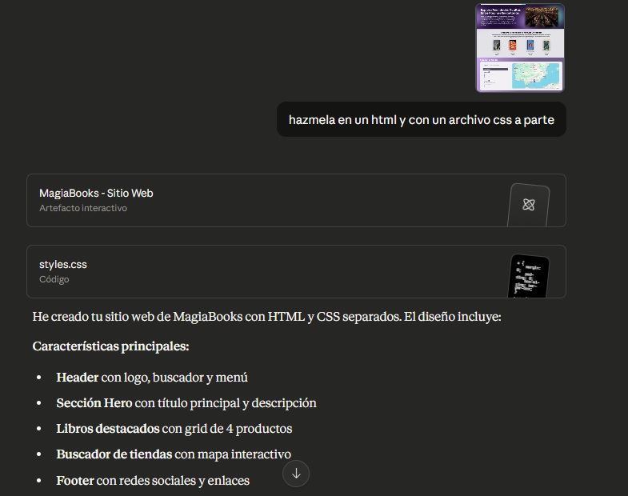

# 📚 Práctica: Desarrollo de Interfaz Web **"Mi Librería"**

## 🧾 Descripción General
Este proyecto consiste en el desarrollo de la interfaz web **"Mi Librería"**, una práctica centrada en la maquetación moderna con **HTML5 y CSS3**, utilizando **Flexbox** y **Grid Layout**. El objetivo principal ha sido implementar de forma **fiel y funcional** un diseño previamente realizado en **Figma**, respetando tanto la estructura como la estética definida en los mockups.

La práctica pone especial énfasis en el uso de **HTML semántico**, la separación de estructura y estilos, el código limpio y un acabado visual profesional.

---

## 🎯 Objetivos del Proyecto
- Aplicar correctamente **HTML5 semántico**.
- Utilizar **CSS Grid** para el layout general y **Flexbox** para los componentes internos.
- Separar estructura (HTML) y estilos (CSS).
- Reproducir fielmente un diseño realizado en **Figma**.
- Crear una interfaz clara, ordenada y visualmente atractiva.

---

## 🛠️ Tecnologías Utilizadas
- HTML5  
- CSS3  
- Flexbox  
- CSS Grid Layout  
- Google Fonts  
- Figma (Dev Mode)  
- Inteligencia Artificial: **Claude** y **ChatGPT**

---

## 🤖 Uso de Inteligencia Artificial en el Desarrollo

Para el desarrollo del proyecto he utilizado **Inteligencia Artificial**, combinando el uso de **Claude** y **ChatGPT**.

---

### 1️⃣ Primera versión con Claude a partir de Figma
Principalmente he usado **Claude**, al que le he pasado **capturas del diseño realizado en Figma**. A partir de estas imágenes, la IA me generó una primera versión del **HTML y CSS**.

> ⚠️ Esta primera generación no era totalmente fiel al diseño original, especialmente en aspectos como anchos de contenedores, espaciados y distribución.

**Ejemplo de capturas usadas:**

---

### 2️⃣ Uso del código de Dev Mode de Figma
Para mejorar la fidelidad, he copiado el **código proporcionado por el Dev Mode de Figma** y se lo pasé nuevamente a Claude. Esto permitió ajustar mejor:

- Tamaños
- Márgenes y paddings
- Tipografías
- Colores

Aun así, la IA siguió cometiendo algunos errores.

**Ejemplo del prompt usado:**

---

### 3️⃣ Corrección manual de errores
Durante el proceso he ido detectando y corrigiendo manualmente diversos fallos, como:

- Ancho incorrecto de algunos contenedores
- Elementos que ocupaban el 100% del ancho sin necesidad
- Problemas de alineación con Grid y Flexbox

Estas correcciones las he realizado directamente sobre el código generado.

---

### 4️⃣ Gestión manual de imágenes
Las imágenes **no fueron generadas automáticamente por la IA**.  
Se añadieron manualmente a una carpeta `img/` dentro del proyecto, asegurando:

- Tamaños consistentes
- Buena calidad
- Imágenes libres de derechos

---

### 5️⃣ Correcciones finales con ChatGPT
En la última fase del proyecto, he utilizado **ChatGPT** para corregir los últimos detalles.  
Se le proporcionaron:

- **Capturas del resultado visual esperado**
- **El mismo código HTML y CSS generado previamente con Claude**

Gracias a esto, se pudieron solucionar problemas finales como:
- Ajuste del ancho de grids
- Centrado de contenidos
- Espaciados verticales
- Detalles visuales del footer y secciones de productos

**Ejemplo de corrección visual:**

---

## ✔️ Checklist

| Requisito | Descripción | Estado |
|---------|------------|--------|
| Flex/Grid | ¿Se usa Grid para el layout general y Flex para componentes? | [x] |
| Semántica | ¿Usa header, nav, main, footer, section, article y aside? | [x] |
| Tipografía | ¿Hay al menos 2 fuentes de Google Fonts aplicadas? | [x] |
| Estética | ¿Hay uso de sombras, bordes redondeados, imágenes y buen manejo del color? | [x] |
| Comentarios | ¿Están explicadas las secciones en HTML y CSS de forma clara? | [x] |
| Fidelidad | ¿El resultado final es fiel al diseño realizado en Figma? | [x] |

---